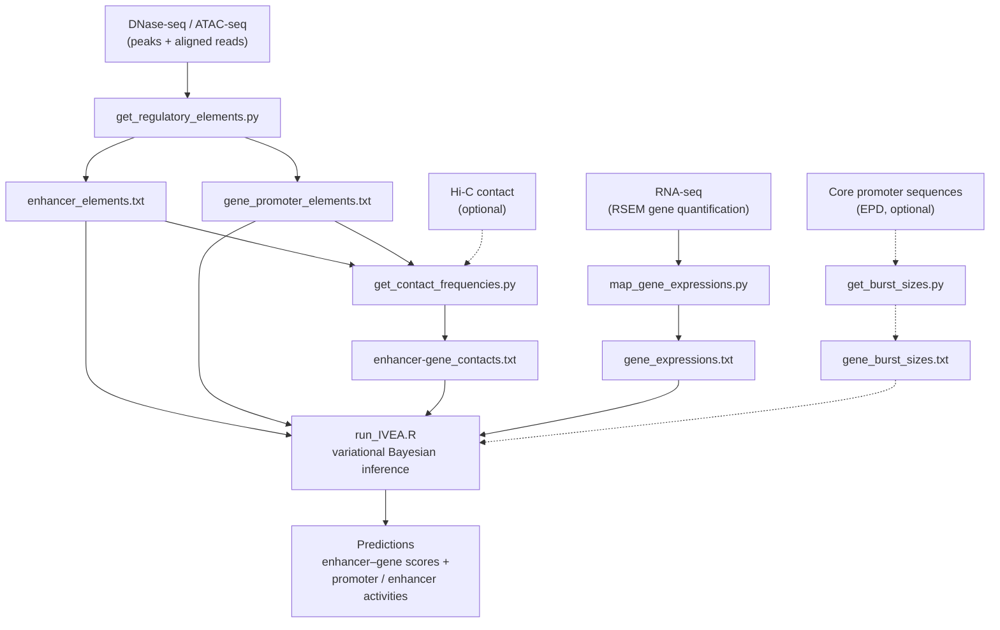

# IVEA

IVEA estimates promoter and enhancer activities and the strength of enhancer–gene regulatory interactions. This repository contains the scripts to prepare necessary input files as well as the scripts for the inference, and example commands for K562 cell line data set.

*Keywords: enhancer–gene regulatory interactions · variational Bayesian inference · enhancer activity · promoter activity · chromatin accessibility · ATAC-seq · DNase-seq · Hi-C · RNA-seq · gene regulation*


## Quick start (~5 minutes)

Go from a clean checkout to a ranked table of enhancer–gene predictions on the
bundled chr22 K562 example. You only need [`git`](https://git-scm.com/) and
[conda](https://docs.conda.io/) (or [mamba](https://mamba.readthedocs.io/)) —
the environment file installs everything else.

```sh
# 1. Get the code and build the environment
#    (this is the only slow step — a few minutes on first run)
git clone https://github.com/yasumasak/ivea.git
cd ivea
conda env create -f environment.yml      # or: mamba env create -f environment.yml
conda activate ivea

# 2. Install the IVEA R package (run from the repository root)
R CMD INSTALL .

# 3. Run the inference on the bundled chr22 intermediates (~2 minutes)
cd example
Rscript ../scripts/run_IVEA.R \
  --chr_region chr22 \
  --alpha_pro 80 --alpha_enh 10 \
  --contacts ./output/enhancer-gene_contacts.chr22.txt \
  --rnas ./output/gene_expressions.txt \
  --rna_cutoff_value 8 \
  --enhancers ./output/enhancer_elements.txt \
  --promoters ./output/gene_promoter_elements.txt \
  --burst_sizes ../reference/gene_burst_sizes.hg19.txt \
  --outdir ./output \
  --no_le_enh FALSE
```

This scores 118,856 enhancer–gene pairs and writes them to
`example/output/predictions_score.chr22.bedpe` (BEDPE) and
`example/output/predictions_info.chr22.txt` (a detailed table). The
highest-scoring interactions should match:

| score    | gene   | enhancer                | TSS distance (bp) |
| -------- | ------ | ----------------------- | ----------------- |
| 0.556446 | POLR2F | chr22:38349413-38349913 | 6                 |
| 0.546424 | RTCB   | chr22:32808030-32808530 | 7                 |
| 0.491633 | DRG1   | chr22:31795299-31795799 | 11                |
| 0.487799 | TRMU   | chr22:46731383-46731883 | 336               |
| 0.446685 | GRAMD4 | chr22:47000197-47000697 | 15851             |

Scores should agree to ~6 significant figures. This step regenerates the
prediction files already shipped in `example/output/`, so in a fresh clone it is
also a self-check that your installation reproduces the reference results.

To run the **full pipeline** from the raw peak / BAM / RNA-seq inputs — not just
the final inference — see [`example/commands_example.sh`](example/commands_example.sh)
and the step-by-step sections below.

For a narrated walk-through that runs IVEA on this chr22 example and then reads one
gene's predicted regulatory landscape and its uncertainty, see the tutorial article
[`vignettes/articles/ivea-k562.Rmd`](vignettes/articles/ivea-k562.Rmd).


## When to use IVEA

IVEA predicts enhancer activity and enhancer–gene regulatory interactions from 
cell-type-specific functional genomics data. It is a good fit when you have:

* chromatin accessibility data (DNase-seq or ATAC-seq), and
* gene expression data (RNA-seq),

and, optionally, chromatin contact data (Hi-C). When Hi-C data are not available, 
IVEA uses a power-law estimate of contact frequency instead. Genomic-sequence-based 
transcriptional burst sizes can also be supplied to scale promoter activity.

Unlike approaches that use measured signals directly, IVEA treats promoter and 
enhancer **activities as latent variables** and infers them using a variational 
Bayesian generative model that jointly explains chromatin accessibility and gene 
expression. In addition to interaction scores, IVEA provides posterior **uncertainty**
for the estimated activities, including 2.5th, 50th, and 97.5th percentile credible 
intervals and posterior standard deviations.

IVEA is particularly useful when you want to:

* Estimate enhancer activity and quantify the regulatory activity of individual enhancers 
  in a specific cellular context.
* Identify highly active enhancer sequences that may serve as candidates for prioritizing 
  regulatory sequences for synthetic DNA design.
* Predict enhancer–gene regulatory interactions by incorporating IVEA-estimated enhancer 
  activity into frameworks such as ABC and gABC.


## Citation

If you use IVEA in your research, please cite:

> Kimura Y, Ono Y, Katayama K, Imoto S. IVEA: an integrative variational Bayesian inference method for predicting enhancer–gene regulatory interactions. *Bioinformatics Advances*. 2024;4(1):vbae118. doi:[10.1093/bioadv/vbae118](https://doi.org/10.1093/bioadv/vbae118)

BibTeX:

```bibtex
@article{kimura2024ivea,
  title     = {IVEA: an integrative variational Bayesian inference method for predicting enhancer--gene regulatory interactions},
  author    = {Kimura, Yasumasa and Ono, Yoshimasa and Katayama, Kotoe and Imoto, Seiya},
  journal   = {Bioinformatics Advances},
  volume    = {4},
  number    = {1},
  pages     = {vbae118},
  year      = {2024},
  doi       = {10.1093/bioadv/vbae118},
  publisher = {Oxford University Press}
}
```

This repository also ships a [`CITATION.cff`](CITATION.cff) file — GitHub renders a **"Cite this repository"** button from it — and an R `inst/CITATION`, so `citation("IVEA")` in R returns the reference above.


## Outline of workflow



The following data are used as input: 
* chromatin accessibility (DNase-seq or ATAC-seq)
* chromatin contact frequency (Hi-C) (Optional)
* gene expression (RNA-seq)
* genomic-sequence based burst sizes (Optional)

The scripts below in ```${IVEA_HOME}/scripts/``` proccess the above data into appropriate data format.
(```${IVEA_HOME}``` denotes a home directory of IVEA.)
* ```get_regulatory_elements.py```
* ```get_contact_frequencies.py```
* ```map_gene_expressions.py```
* ```get_burst_sizes.py```

  chromosome and gene annotation files (provided in ```${IVEA_HOME}/reference/``` for both hg19 and hg38) are used in the scripts. The example commands below use the hg19 files (the build of the paper's analyses); see [Genome builds: hg19, hg38, and other genomes](#genome-builds-hg19-hg38-and-other-genomes) to run on hg38 or any other genome.

Finally, ```run_IVEA.R``` in ```${IVEA_HOME}/scripts/``` performs variational Bayesian inference to predict enhancer-gene regulatory interactions.

The core functions for the variational inference are implemented in R scripts in ```${IVEA_HOME}/R``` directory as IVEA package. 
Users need to install the IVEA package (```R CMD INSTALL ${IVEA_HOME}```) before running the R script.

The example commands in the following sections are supposed to run in ```${IVEA_HOME}/example/``` and available in ```${IVEA_HOME}/example/commands_example.sh```


## Installation

All dependencies (Python 3.12, R 4.5, the command-line tools, and the Python/R
packages) are captured in [`environment.yml`](environment.yml). Create the
environment with [conda](https://docs.conda.io/) / [mamba](https://mamba.readthedocs.io/):

```
mamba create -n ivea -f environment.yml   # (or: conda env create -f environment.yml)
conda activate ivea
```

Then install the IVEA R package itself from the repository root:

```
R CMD INSTALL ${IVEA_HOME}
```

## Dependencies

The environment above pins the following (a working set is given in parentheses):

```
Python (3.12)
R (4.5)
samtools (1.20)
bedtools (2.31)
MACS3 - Partial dependancy (peak calling; successor to MACS2)
RSEM - Partial dependancy
liftOver (ucsc-liftover) - Partial dependancy

Python packages:
pandas (2.x)
numpy (2.x)
scipy (1.13)
bioframe (0.7+)   # pandas-native genomic interval operations

R packages:
optparse
data.table
Matrix
invgamma
roxygen2, testthat  # development / testing only
methods, utils      # base R
```

Notes for users coming from older releases:
* `pyranges` and `gtfparse` are no longer required — interval overlaps now use
  `bioframe`, and GTF parsing uses a small built-in reader.
* `ghyp` is no longer required — the generalized inverse Gaussian expectations are
  computed in closed form with base R `besselK`.
* Peak calling uses `MACS3` (installs cleanly on Python 3.12 and emits the same
  `narrowPeak` output with `--call-summits`).


## Regulatory element

Regulatory elements (REs) are defined by peaks on a DNase-seq or ATAC-seq. The counts of reads mapped on the defined REs and the lengthes of REs are used in the variational inference.

Here we first use MACS3 to call peaks and then use ```get_regulatory_elements.py``` that defines REs, count mapped reads, and classify them into promoter/enhancer.

### Call peaks with MACS3

Example with K562 chr22 (the ```-n``` name is kept as ```.macs2``` only so the
output matches the file names shipped in ```example/output/```):
```
macs3 callpeak \
-t ./input/wgEncodeUwDnaseK562AlnMerged.chr22.sorted.bam \
-n wgEncodeUwDnaseK562AlnMerged.chr22.macs2 \
-f BAM -g hs -p .1 \
--call-summits \
--outdir ./output
```

The resultant ```${dnase_name}_peaks.narrowPeak``` is used in the next.

### Define regulatory elements

The following processing steps are taken in ```get_regulatory_elements.py```:
 1. Count DNase-seq/Atac-seq reads in each peak and retain the top N peaks (```--n_peaks```) with the most read counts.
 2. Resize each of these N peaks to be a fixed number of base pairs (```--extension_from_summit```) centered on the peak summit.
 3. Remove any regions listed in the 'blacklist' (```--regions_blacklist```) and include any regions listed in the 'whitelist' (```--regions_whitelist```).
 4. Merge any overlapping regions. The merged peaks are defiend as REs.
 5. Classify the REs. A promoter element for a gene is defined as sum of REs in a region that spans a fixed number of base pairs (```--tss_slop_for_class_assignment```) from the gene TSSs. All REs are considered as enhancer elements, including REs found in the promoter regions, since gene promoters can potentially act as enhancers (Dao et al., 2017; Andersson and Sandelin, 2020).

Example with K562 chr22:
```
python ${IVEA_HOME}/scripts/get_regulatory_elements.py \
--outdir ./output \
--narrowPeak ./output/wgEncodeUwDnaseK562AlnMerged.chr22.macs2_peaks.narrowPeak \
--bam ./input/wgEncodeUwDnaseK562AlnMerged.chr22.sorted.bam \
--chrom_sizes ${IVEA_HOME}/reference/hg19.chrom.sizes \
--regions_blacklist ${IVEA_HOME}/reference/wgEncodeHg19ConsensusSignalArtifactRegions.bed \
--extension_from_summit 250 \
--genes ${IVEA_HOME}/reference/RefSeqCurated.170308.bed.CollapsedGeneBounds.excl_chrY.Fulco_2019.bed \
--tss_slop_for_class_assignment 1000 \
--n_peaks 3000 # 150000 (default) is recommended for genome-wide analysis. 3000 is just used for the small example on chr22.
```
Main outputs:
* **enhancer_elements.txt**: Enhancer elements with Dnase-seq (or ATAC-seq) read counts.
* **gene_promoter_elements.txt**: Gene promoter elements with Dnase-seq (or ATAC-seq) read counts.


## Contact frequency

Contact frequencies between the gene TSSs and the enhancer elements are used in the variational inference. ```get_contact_frequencies.py``` processes Hi-C data with gene TSSs and enhancer elements information to provide contact frequencies of enhancer-gene pairs.

The following Hi-C data processing steps reported in Fulco et al (2019) are used:
1. Each diagonal entry of the Hi-C matrix is replaced by the maximum of its four neighbouring etries.
2. All entries of the Hi-C matrix with a value of NaN or corresponding to KR normalization factors < 0.25 are replaced with the expected contact under the power-law distribution with the law's exponent (```--hic_gamma```).
3. A small adjustment (pseudocount) is added to the entries of the Hi-C matrix. For the entries with distance larger than the pseudocount distance (```--hic_pseudocount_distance```), the expected contact frequency under the power-law distribution is added. For those within the pseudocount distance, a constant adjustment equal to the expected contact frequency at the pseudocount distance is added.

### Format of Hi-C data
* Juicer format: Three column 'sparse matrix' format representation of a Hi-C matrix.
* BEDPE format: More general format which can support variable and arbitrary bin sizes by specifying ```--hic_type bedpe```. Note that if contact data is provided in BEDPE format, the 1st and 2nd processing of the Hi-C data described above are **not** applied. The BEDPE file should be a tab-delimited file containing 8 columns (chr1,start1,end1,chr2,start2,end2,name,score) where score denotes the contact frequency. 

### Without experimental Hi-C contact data
If experimentally derived contact data is not available, two alternative approaches can be taken.
* Powerlaw-estimate: The powerlaw-estimated contact frequency is applied by not specifying ```--hicdir```. It has been shown that Hi-C contact frequencies generally follow a powerlaw relationship (with respect to genomic distance) and that many TADs, loops and other structural features of the 3D genome are **not** cell-type specific (Sanborn et al 2015, Rao et al 2014). 
* Average Hi-C: The average Hi-C matrix (averaged across 10 cell lines, at 5kb resolution: GM12878, NHEK, HMEC, RPE1, THP1, IMR90, HUVEC, HCT116, K562, KBM7) can be downloaded from: <ftp://ftp.broadinstitute.org/outgoing/lincRNA/average_hic/average_hic.v2.191020.tar.gz> (20 GB). The average Hi-C profile showed approximately equally good performance as using a cell-type specific Hi-C profile (Fulco et al 2019). 

Example with K562 chr22 without Hi-C contact data:
```
python ${IVEA_HOME}/scripts/get_contact_frequencies.py \
--enhancers ./output/enhancer_elements.txt \
--promoters ./output/gene_promoter_elements.txt \
--window 5000000 \
--outdir ./output \
--chromosomes chr22 \
#--hicdir ./input/HiC/raw \ # Set when using Hi-C contact data.
#--hic_resolution 5000 \ # Set when using Hi-C contact data.
```
Main outputs:
* **enhancer-gene_contacts.chr?.txt**: Contact frequencies between the gene TSSs and the enhancer elements.


## Gene expression

Gene-level RNA-seq read counts and effective lengths are used in the variational inference. The genes analyzed in the variational inference are filtered based on transcripts per million (TPM) by default.

### RSEM 

Here we use ```'genes.result'``` generated by RSEM that contains gene-level read counts, TPM and effective lengths.

Example with K562:
```
rsem-calculate-expression
--star-gzipped-read-file --no-bam-output --star-output-genome-bam --estimate-rspd
--star --star-path STAR_PATH
--paired-end ./input/ENCFF001REG.fastq.gz ./input/ENCFF001REF.fastq.gz
${reference_gencode_v26lift37} ./output/ENCFF001REG-ENCFF001REF_rsem
```
```${reference_gencode_v26lift37}``` is a Gencode-based reference generated by RSEM ```rsem-prepare-reference``` command using ```${IVEA_HOME}/reference/gencode.v26lift37.annotation.gtf```.

### Refseq-based reference

In the K562 example, we use RefSeq-based gene annotation as a reference which is different from one used in RSEM (Gencode-based). In such case, ```map_gene_expressions.py``` can be used to map Gencode-based RSEM ```'genes.result'``` to the RefSeq-based reference. 

Example with K562:
```
python ${IVEA_HOME}/scripts/map_gene_expressions.py \
--bed_ref ${IVEA_HOME}/reference/RefSeqCurated.170308.bed.CollapsedGeneBounds.excl_chrY.Fulco_2019.bed \
--gtf_gencode ${IVEA_HOME}/reference/gencode.v26lift37.annotation.gtf.gz \
--rsem ./output/ENCFF001REG-ENCFF001REF_rsem.genes.results \
--outdir ./output
```
Main outputs:
* **gene_expressions.txt**: Gene-level read counts, TPM and effective lengths.

### Gencode-based reference

In case of using Gencode-based reference (same as in RSEM) in IVEA, ```get_gencode_bed.py``` can be used to generate gene position BED file and gene id/name list file from the Gencode gtf file, and ```get_gencode_expression.py``` can be used to make ```'gene_expressions.txt'``` from RSEM ```'genes.result'```. 


## Transcriptional burst size

Transcriptional burst size estimate is used to scale the gene promoter activity in the variational inference. Larsson et al (2019) found that burst size can be estimated from core promoter sequence elements and gene body length. ```get_burst_sizes.py``` utilizes the regression formula reported in Larsson et al (2019) and provides gene-wise burst size estimates. 

Firstly, the Eukaryotic Promoter Database (EPD) data are needed to be downloaded from ftp://ccg.epfl.ch/.
For the human reference genome hg19, the following files were downloaded to ```${EPD_dir}```.
- epdnew/H_sapiens/005/Hs_EPDnew_005_hg19.bed
- epdnew/H_sapiens/005/db/promoter_motifs.txt
- epdnew/H_sapiens_nc/001/HsNC_EPDnew_001_hg38.bed
- epdnew/H_sapiens_nc/001/db/promoter_motifs.txt

The HsNC_EPDnew_001_hg38.bed was lifted to hg19 by liftOver.

Example for hg19:
```
python ${IVEA_HOME}/scripts/get_burst_sizes.py \
--epd_bed_file ${EPD_dir}/epdnew/H_sapiens/005/Hs_EPDnew_005_hg19.bed \
--epd_motif_file ${EPD_dir}/epdnew/H_sapiens/005/db/promoter_motifs.txt \
--epd_bed_file_2 ${EPD_dir}/epdnew/H_sapiens_nc/001/HsNC_EPDnew_001_hg19.lifted.bed \
--epd_motif_file_2 ${EPD_dir}/epdnew/H_sapiens_nc/001/db/promoter_motifs.txt \
--genes ${IVEA_HOME}/reference/RefSeqCurated.170308.bed.CollapsedGeneBounds.excl_chrY.Fulco_2019.bed \
--outdir ./output
```
Main outputs:
* **gene_burst_sizes.txt**: Gene-wise burst size estimates.

A set of burst sizes obtained by the example command above for hg19 is available as ```${IVEA_HOME}/reference/gene_burst_sizes.hg19.txt```. 


## Variational Bayesian inference for predicting enhancer-gene regulatory interactions

The variational Bayesian inference for predicting enhancer-gene regulatory interactions is made by  ```run_IVEA.R```. It provides estimates of promoter and enhancer activities, and scores of enhancer-gene regulatory interactions.

The core functions for the variational inference are implemented in R scripts in ```${IVEA_HOME}/R``` directory as IVEA package. 
Users need to install the IVEA package (```R CMD INSTALL ${IVEA_HOME}```) before running the R script.

The inference can be run in parallel in a chromosomal basis. 

Example with K562 chr22:
```
Rscript ${IVEA_HOME}/scripts/run_IVEA.R \
--chr_region chr22 \
--alpha_pro 80 \
--alpha_enh 10 \
--contacts ./output/enhancer-gene_contacts.chr22.txt \
--rnas ./output/gene_expressions.txt \
--rna_cutoff_value 8 \
--enhancers ./output/enhancer_elements.txt \
--promoters ./output/gene_promoter_elements.txt \
--burst_sizes ${IVEA_HOME}/reference/gene_burst_sizes.hg19.txt \
--outdir ./output \
--no_le_enh FALSE # FALSE performs original IVEA whereas TRUE (default) performs IVEA_nolE.
```
Main outputs:
* **predictions_score.chr?.bedpe**: Prediction result in BEDPE format (enhancer and gene TSS position, and their interaction score).
* **predictions_info.chr?.txt**: Prediction result with detailed information: gene (name, chromosome, TSS), promoter (name, read count, length, activity), enhancer (name, read count, length, activity), and regulatory interaction (distance, contact frequency, strength, contribution, score).
* **estimates.enhancer_activity.chr?.bed**: Estimated enhancer activities in BED format (enhancer position, name and estimated enhancer activity).
* **estimates.promoter_activity.chr?.bed**: Estimated promoter activities in BED format (gene TSS, name and estimated promoter activity).
* **estimates.enhancer_activity.chr?.txt**: Estimated enhancer activities with details (enhancer position, name and estimated enhancer activity (expected value, 2.5, 50, and 97.5 percentile values, standard deviation, and shape and rate parameters)).
* **estimates.promoter_activity.chr?.txt**: Estimated promoter activities with details (gene TSS, name and estimated promoter activity (expected value, 2.5, 50, and 97.5 percentile values, standard deviation, and shape and rate parameters)).


## Genome builds: hg19, hg38, and other genomes

IVEA is **genome-agnostic**. The R package and the preprocessing scripts contain no
hardcoded genome build, chromosome sizes, or coordinate offsets — the build is
determined entirely by the reference files you pass on the command line. The only
requirement is that every input in a run uses the same build and UCSC `chr`-prefixed
chromosome names.

The analyses in Kimura et al. 2024 were performed on **hg19**, so hg19 remains the
reproduce-the-paper default and backs the bundled chr22 K562 example. For studies
aligned to **GRCh38**, this repository also ships a complete hg38 reference set. Both
sets live flat in `${IVEA_HOME}/reference/` with a build suffix; see
[`reference/README.md`](reference/README.md) for the full build map and provenance.

| Purpose (CLI arg) | hg19 file | hg38 file |
|---|---|---|
| chrom sizes (`--chrom_sizes`) | `hg19.chrom.sizes` | `hg38.chrom.sizes` |
| blacklist (`--regions_blacklist`) | `wgEncodeHg19ConsensusSignalArtifactRegions.bed` | `hg38-blacklist.v2.bed` |
| collapsed gene bounds (`--genes`, `--bed_ref`) | `RefSeqCurated.170308.bed.CollapsedGeneBounds.excl_chrY.Fulco_2019.bed` | `CollapsedGeneBounds.hg38.bed` |
| GENCODE GTF (`--gtf_gencode`; RSEM ref) | `gencode.v26lift37.annotation.gtf.gz` (vendored) | `gencode.v26.annotation.gtf.gz` (fetched) |
| burst sizes (`--burst_sizes`, optional) | `gene_burst_sizes.hg19.txt` | `gene_burst_sizes.hg38.txt` |

To run on hg38, first fetch the one large file that is not vendored (the GENCODE GTF):

```
bash ${IVEA_HOME}/scripts/fetch_reference.sh hg38        # GENCODE v26 (default)
# bash ${IVEA_HOME}/scripts/fetch_reference.sh hg38 48   # or a newer release
```

The reference set defaults to **GENCODE release 26** (the release used in the paper),
which keeps the GTF consistent with the provided `CollapsedGeneBounds.hg38.bed` and
hg38 burst sizes. You can fetch a newer release by passing its number, but then
regenerate the gene bounds and burst sizes from that release so they match — see
[`reference/README.md`](reference/README.md).

Then run exactly the same pipeline as the hg19 walk-through above, pointing each
`--*` reference argument at the hg38 file from the table (and building the RSEM
reference from `gencode.v26.annotation.gtf.gz`). For example, the inference step:

```
Rscript ${IVEA_HOME}/scripts/run_IVEA.R \
--chr_region chr22 \
... \
--burst_sizes ${IVEA_HOME}/reference/gene_burst_sizes.hg38.txt \
--outdir ./output
```

Notes:
* **Keep the build consistent.** Every input (accessibility peaks/BAM, contacts,
  expression, and all reference files) must be the same build. Mixing builds silently
  produces wrong coordinates.
* **RSEM reference.** Build it from the same GTF as the run — `gencode.v26.annotation.gtf.gz`
  for hg38.
* **Chromosome set.** Restrict or extend the analysed chromosomes at runtime with
  `--chromosomes` / `--include_chrY` rather than editing code.
* **Other genomes.** Any organism/build works the same way: supply a matching
  `chrom.sizes` (+`.bed` sidecar), a collapsed gene-bounds BED-6 with unique names, an
  optional blacklist, a GTF, and optional burst sizes — all on the same build with
  `chr`-prefixed names.

The hg38 reference set is provided as well-formed, ready-to-use inputs; full end-to-end
*numeric* validation on hg38 is not bundled because it would require an hg38-aligned
K562 dataset (the shipped example BAM is hg19).

## Contact
Please submit a github issue with any questions or if you experience any issues/bugs. 
